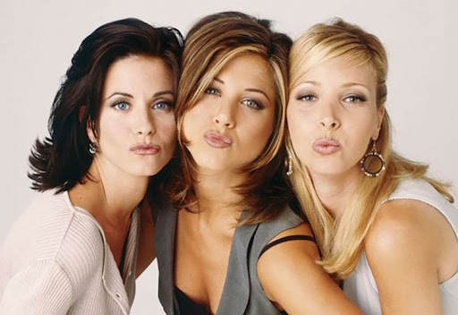
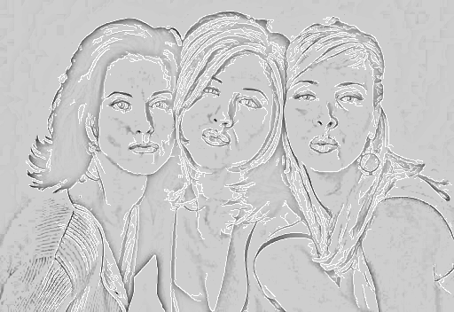

# Sketchify 🎨

Sketchify is a Python project that converts an input image into a pencil sketch. This project uses image processing techniques like grayscale conversion, Gaussian blur, edge detection, and dodge blending to create realistic sketch effects.

## 📌 Features
- Converts any image to grayscale.
- Applies Gaussian blur and dodge effect to mimic pencil strokes.
- Performs edge detection to enhance sketch details.
- Increases contrast for a sharper and more professional sketch look.

## 📂 Input and Output Examples
### Input Image:

### Output Sketch:

---

⚙️ Technical Details
Programming Language: Python
Libraries Used:
numpy for array manipulation.
imageio for image file reading.
scipy for Gaussian blur.
opencv-python for edge detection and image manipulation.

Techniques:
Grayscale Conversion: Converts RGB images to grayscale.
Gaussian Blur: Smoothens the image for a sketch-like effect.
Dodge Blending: Creates the sketch effect by blending the image with its inverted blurred version.
Edge Detection: Enhances the outline details